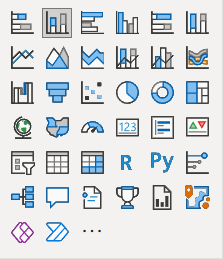
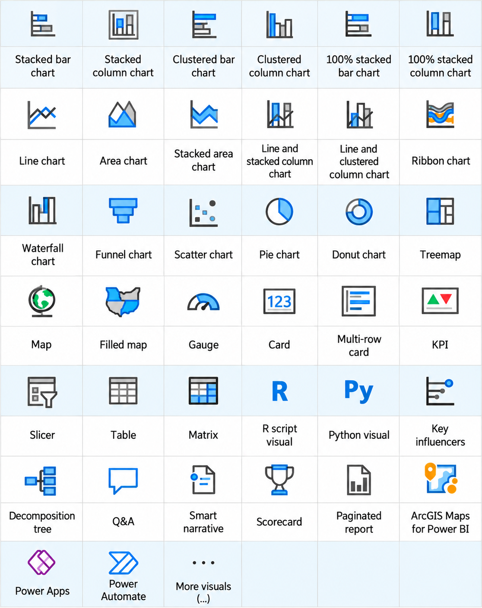
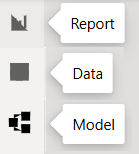
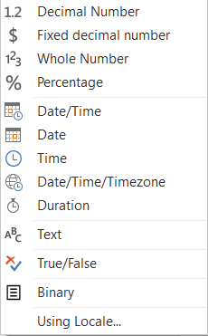
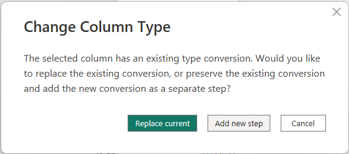

# Power BI | Formatting, Visualizations, Dashboards

comment

### Table of Content   

- [Prerequisites](#colororangetextPrerequisites) 
- [References](#colororangetextReferences)   
- [Power BI Desktop Visualizations pane](#colororangetextPower-BI-Desktop-Visualizations-pane)   
- [Power Query](#colororangetextPower-Query)
  - [Data Types](#colororangetextData-Types)
  - [Power Query: Replace current vs Add new step](#colororangetextPower-Query-Replace-current-vs-Add-new-step)
  - [...........](#colororangetext........... )
  - [...........](#colororangetext........... )    
- [...........](#colororangetext........... )
- [...........](#colororangetext........... )
- [...........](#colororangetext........... )
- [...........](#colororangetext........... )
- [...........](#colororangetext........... )
- [...........](#colororangetext........... )
- [...........](#colororangetext........... )
- [...........](#colororangetext........... )      
- [Terminology](#colororangetextTerminology)
- [22222. The Promise-Based ,`async/await` (Pattern) in Node.js](#22222-The-Promise-Based-asyncawait-Pattern-in-Nodejs)

<!----------------------------------------------------------------------------------------->
 

# $$\color{orange}{\text{Prerequisites}}$$
1. C++
2. Java

# $$\color{orange}{\text{References}}$$
1. [[from](https://www.microsoft.com/en-gb/download/details.aspx?id=58494) ](https://www.microsoft.com/en-gb/download/details.aspx?id=58494)
1. Second ordered list
1. Third ordered list

<!----------------------------------------------------------------------------------------->
 

# $$\color{orange}{\text{Power BI Desktop Visualizations pane}}$$

| Row | 1st icon | 2nd icon | 3rd icon | 4th icon | 5th icon | 6th icon |
|---|---|---|---|---|---|---|
| **1** | Stacked bar chart | Stacked column chart | Clustered bar chart | Clustered column chart | 100% stacked bar chart | 100% stacked column chart |
| **2** | Line chart | Area chart | Stacked area chart | Line and stacked column chart | Line and clustered column chart | Ribbon chart |
| **3** | Waterfall chart | Funnel chart | Scatter chart | Pie chart | Donut chart | Treemap |
| **4** | Map | Filled map | Gauge | Card | Multi-row card | KPI |
| **5** | Slicer | Table | Matrix | R script visual | Python visual | Key influencers |
| **6** | Decomposition tree | Q&A | Smart narrative | Scorecard | Paginated report | ArcGIS Maps for Power BI |
| **7** | Power Apps | Power Automate | More visuals (`...`) | | | |

[Visualization Pane](https://learn.microsoft.com/en-us/power-bi/visuals/power-bi-visualizations-overview)

---

---

<!----------------------------------------------------------------------------------------->
 

# $$\color{orange}{\text{Power Query}}$$

<!----------------------------------------------------------------------------------------->
 

# $$\color{orange}{\text{Data Types}}$$

A **data type** tells Power Query what kind of value a column contains and how to process it.

## Power Query Data Types

| Data Type | Keyword / M Type | Typical Size | Description | Example | Range |
|---|---|---|---|---|---|
| **Decimal Number** | `type number` | 8 bytes | Stores whole and fractional numbers using floating-point representation. Approximately 15 significant digits of precision. | `19.95` | Approximately `−1.79 × 10^308` to `+1.79 × 10^308`. |
| **Fixed decimal number** | `Currency.Type` | 8 bytes | Stores numbers with four decimal places of precision. Commonly used for financial values. | `19.9500` | `−922,337,203,685,477.5808` to `922,337,203,685,477.5807`. |
| **Whole Number** | `Int64.Type` | 8 bytes | Stores integers without decimal places. | `25` | `−9,223,372,036,854,775,808` to `9,223,372,036,854,775,807`. |
| **Percentage** | `Percentage.Type` | 8 bytes | Stores a decimal number and displays it as a percentage. | `0.25` → `25%` | Same underlying numeric range as Decimal Number; not limited to `0%–100%`. |
| **Date/Time** | `type datetime` | Implementation-dependent | Stores a date and a time together. | `#datetime(2026, 9, 26, 14, 30, 0)` | Years `1–9999` in M; Power BI model limits differ. |
| **Date** | `type date` | Implementation-dependent | Stores a date without a time. | `#date(2026, 9, 26)` | `0001-01-01` to `9999-12-31` in M. |
| **Time** | `type time` | Implementation-dependent | Stores a time of day without a date. | `#time(14, 30, 0)` | Normally `00:00:00` to `23:59:59.9999999`. |
| **Date/Time/Timezone** | `type datetimezone` | Implementation-dependent | Stores a date and time with a UTC offset. | `#datetimezone(2026, 9, 26, 14, 30, 0, 10, 0)` | Years `1–9999` in M, subject to valid timezone-offset limits. |
| **Duration** | `type duration` | Implementation-dependent | Stores elapsed time in days, hours, minutes, and seconds. | `#duration(2, 3, 30, 0)` = 2 days, 3 hours, 30 minutes | Approximately `−10,675,199` to `+10,675,199` days. |
| **Text** | `type text` | Variable | Stores Unicode characters, including numbers treated as text. | `"Rice"`, `"00123"` | Up to `268,435,456` Unicode characters according to Power Query documentation. |
| **True/False** | `type logical` | Implementation-dependent | Stores a Boolean value. | `true` or `false` | Two logical values: `true` and `false`. |
| **Binary** | `type binary` | Variable | Stores raw bytes, such as file contents. | `#binary({65, 66, 67})` | Each byte is `0–255`; total length depends on resource limits. |

### Notes

- **Typical Size** describes the underlying numeric representation where specified. Actual memory usage includes overhead, and Power BI model compression affects storage size.
- **Implementation-dependent** means a fixed per-value memory size is not guaranteed here.
- **Range** describes supported values, not how many decimal digits remain accurate.
- Power Query **M** supports dates from year `1`; loading dates into the Power BI model has more restrictive limits.
- **Using Locale...** is a conversion option, not a data type. It controls how regional number and date formats are interpreted.

### Example for `price`

`price`: `"19.95"` (Text) → `19.95` (Decimal Number)

The value changes from **text containing digits** to **a number that can be used in calculations**.

`price`: `19.95` (Decimal Number) → Fixed decimal number

The value uses **fixed precision of four decimal places**, equivalent to `19.9500`. The display may omit trailing zeros.

### Using Locale

**Using Locale...** is a conversion option, not a separate data type.

It tells Power Query which regional rules to use when interpreting values.

- `"1,234.56"` + English (United States) → `1234.56`
- `"1.234,56"` + German (Germany) → `1234.56`
- `"26/09/2026"` + English (Australia) → 26 September 2026

<!----------------------------------------------------------------------------------------->
 

# $$\color{orange}{\text{Power Query: Replace current vs Add new step}}$$

This message appears because the column already has a data type conversion in **Applied Steps**.

| Option | What happens | When to use it |
|---|---|---|
| **Replace current** | Changes the existing type conversion step to your new choice. | The previous data type was a mistake. |
| **Add new step** | Keeps the previous conversion and adds another conversion after it. | You intentionally need both conversions in sequence. |

### Example 1 : Replace current vs Add new step

Suppose `Price` contains `8.75`, but an existing step converts it to **Whole Number**. You now select **Decimal Number**:

1. **Replace current:** Power Query changes the existing step to convert `Price` directly to Decimal Number.
2. **Add new step:** Power Query first converts `Price` to Whole Number, then converts that result to Decimal Number. Any precision lost in the first step cannot be recovered by the second step.

**Rule of thumb:** If you are correcting the column's data type, choose **Replace current**.

## Example 2 : Replace current vs Add new step

**Your actions:**

`price`: `Text` → changed to `Decimal number` → now changing to `Fixed decimal number`   

### Replace current

`price`: `Text` → `Fixed decimal number`

The existing conversion to **Decimal number** is replaced with a conversion to **Fixed decimal number**.

**Result: One conversion step.**

### Add new step

`price`: `Text` → `Decimal number` → `Fixed decimal number`

The existing conversion to **Decimal number** is kept, and another step converts its result to **Fixed decimal number**.

**Result: Two conversion steps.**

<!----------------------------------------------------------------------------------------->
 

# $$\color{orange}{\text{First Title}}$$

                  
                  

💡
✅ 
🎓 Academic Honesty
📚 References
🔗 [Node.js Official site](https://nodejs.org/)
💻 Source Code

Insert an emoji On Windows, press: `Windows key + .`

### [Nginx More](./Material/Nginx.md "Nginx is a web server, reverse proxy and load balancer.")

# 22222. The Promise-Based ,`async/await` (Pattern) in Node.js

# $$\color{orange}{\text{Terminology}}$$

| Syntax      | Description | Test Text     |
| :---        |    :----:   |          ---: |
| Header      | Title       | Here's this   |
| Paragraph   | Text        | And more      |

