# Power BI Tutorial

# Power BI | Formatting, Visualizations, Dashboards : A
[](https://www.youtube.com/watch?v=I0vQ_VLZTWg)
<br />
# Power BI Full Course - Learn Skills Daily :B
[](https://www.youtube.com/watch?v=e6QD8lP-m6E)
comment

[](https://github.com/Johnnyboycurtis/webproject   )

<hr>

### Table of Content   

- [Prerequisites](#colororangetextPrerequisites) 
- [References](#colororangetextReferences)
- [Module 1 - Fundemental](#colorpurpletextModule-1---Fundemental)
  - [Lesson 2 - Power BI Apps and Services](#colorpurpletextLesson-2---Power-BI-Apps-and-Services)
  - [Bring data table from website](#colorpurpletextBring-data-table-from-website)
  - [Splash Screen](#colorpurpletextSplash-Screen)
  - [Power BI Desktop Visualizations pane](#colororangetextPower-BI-Desktop-Visualizations-pane)
  - [Data Types](#colororangetextData-Types)   
- [Power Query](#colororangetextPower-Query)
  - [](url)
  - [What Is Power Query M?](#colororangetextWhat-Is-Power-Query-M)   
  - [Power Query: Replace current vs Add new step](#colororangetextPower-Query-Replace-current-vs-Add-new-step)
  - [...........](#colororangetext........... )
  - [...........](#colororangetext........... )    
- [Pivote and Upivote](#colororangetextPivote-and-Upivote)
  - [Pivat Table definition](colororangetextPivat-Table-definition)
- [Introduction to DAX](#colororangetextIntroduction-to-DAX)
- [Hierachy in Visualization](#colororangetextHierachy-in-Visualization)
- [Bins and List Grouping in Power BI](#colororangetextBins-and-List-Grouping-in-Power-BI)
  - [Grouping and Binning in Power BI](#Grouping-and-Binning-in-Power-BI)
  - [List Grouping in Power BI](#List-Grouping-in-Power-BI)
- [...........](#colororangetext........... )
- [...........](#colororangetext........... )
- [...........](#colororangetext........... )
  - [...........](#colorpurpletext........... )      
- [Terminology](#colororangetextTerminology)
- [22222. The Promise-Based ,`async/await` (Pattern) in Node.js](#22222-The-Promise-Based-asyncawait-Pattern-in-Nodejs)


<!-----------------------------------------------------------------------------------------><hr /> 

# $$\color{orange}{\text{Prerequisites}}$$
1. C++
2. Java

# $$\color{orange}{\text{References}}$$
1. [[from](https://www.microsoft.com/en-gb/download/details.aspx?id=58494) ](https://www.microsoft.com/en-gb/download/details.aspx?id=58494)
1. Second ordered list
1. Third ordered list

<!-----------------------------------------------------------------------------------------><hr /> 
# $$\color{purple}{\text{Module 1 - Fundemental}}$$

# 📊 Data Analytics and Microsoft© Power BI
## 📘 Module 1 – Lesson 1

- 🔍 As the process of analyzing raw data to find trends and answer questions, the definition of data analytics captures its broad scope of the field. However, it includes many techniques with many different goals.

- 🧩 The data analytics process has some components that can help a variety of initiatives. By combining these components, a successful data analytics initiative will provide a clear picture of where you are, where you have been and where you should go.

- 📈 Data analytics is a broad field. There are four primary types of data analytics:
  - 📋 **Descriptive analytics**
  - 🔎 **Diagnostic analytics**
  - 🔮 **Predictive analytics**
  - 🧭 **Prescriptive analytics**

  Each type has a different goal and a different place in the data analysis process. These are also the primary data analytics applications in business.

- Data Analysts provide real-time insights across an organization.

## 🔗 Connect, prepare and model

- Connect to and transform data with advanced data preparation capabilities.

## 📊 Visualize

- Create interactive data visualizations and uncover important insights.

## 📤 Publish and share

- Publish dashboards and share insights to drive informed action throughout your organization.

## 🔑 Features vary based on licensing

| License Type | Capabilities | Additional capabilities when workspace is in a Premium Capacity |
|---|---|---|
| Power BI (free) | Access to content in My Workspace | Consume content shared with them |
| Power BI Pro | Publish content to other workspaces, share dashboards, subscribe to dashboards and reports, share with users who have a Pro license | Distribute content to users who have free licenses. |
| Power BI Premium Per User | Same as Pro. Can also share with users who have a Premium Per User license | Distribute content to users who have free and Pro licenses. |
| Power BI Premium Per Capacity | Same as Premium Per User. | |


<!-----------------------------------------------------------------------------------------><hr /> 
# $$\color{purple}{\text{Lesson 2 - Power BI Apps and Services}}$$
**B**   

**Power BI** is Microsoft’s platform for analysing data and sharing interactive reports.

| App / Service | Main purpose |
|---|---|
| **Power BI Desktop** | Windows application for connecting to data, transforming it, building data models, and creating reports. |
| **Power BI Service** | Cloud service for publishing, sharing, and collaborating on reports and dashboards. |
| **Power BI Mobile** | Mobile app for viewing and interacting with reports and dashboards. |
| **Power BI Report Builder** | Application for creating paginated reports designed for printing, such as invoices. |
| **Power BI Report Server** | On-premises server for hosting and managing reports within an organisation. |
| **On-premises data gateway** | Software that securely connects Power BI Service to data stored on local networks. |
| **Power BI Embedded** | Azure service for embedding Power BI reports into custom applications and websites. |

# 📊 The Landscape of Products and Services in Power BI

- Power BI Desktop
- Power BI Service (which is in the cloud ; is a cloud-based service)
- Power BI Report Builder

## 📊 Power BI Desktop and Power BI Service

💡 Power BI Desktop (application) and Power BI Service (cloud-based) are bundled together. Even the free version has a robust feature set.

| Power BI Desktop | Both | Power BI Service |
|---|---|---|
| Many data sources | Reports | Some data sources |
| Transforming | Visualizations | Dashboards |
| Shaping & modeling | Security | Apps & workspaces |
| Measures | Filters | Sharing |
| Calculated columns | Bookmarks | Dataflow creation |
| Python | Q&A | Paginated reports |
| Themes | R visuals | RLS management |
| RLS creation | | Gateway connections |

💡 **Power BI Report builder** allows for the creation of **paginated reports** in the Power BI Service.

💡**Terminology**: The excel workbook called `Sample Superstore` is our **data source**, once you bring the data into power BI desktop it's known as a `dataset`.

<!-----------------------------------------------------------------------------------------><hr /> 

- [x] Update or delete relationships when refreshing data

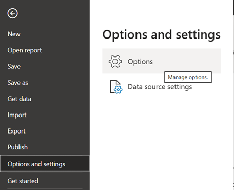

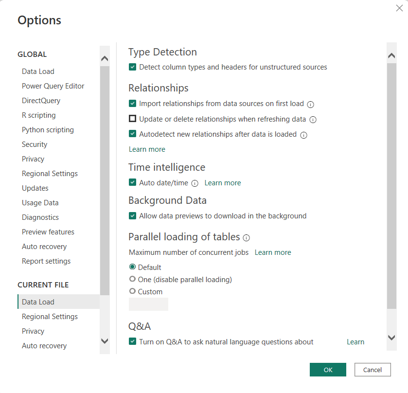

<!-----------------------------------------------------------------------------------------><hr /> 
# $$\color{purple}{\text{Bring data table from website}}$$
**B**  

[List of U.S. states and territories by income](https://en.wikipedia.org/wiki/List_of_U.S._states_and_territories_by_income)   
[Median Household Income By State 2021 (worldpopulationreview.com)](https://worldpopulationreview.com/state-rankings/median-household-income-by-state)   
[Pricing & Product Comparison | Microsoft Power BI](https://powerbi.microsoft.com/en-us/pricing/)   
[Row-level security (RLS) with Power BI - Power BI | Microsoft Docs](https://docs.microsoft.com/en-us/power-bi/admin/service-admin-rls#validate-the-roles-within-power-bi-desktop)   


<!-----------------------------------------------------------------------------------------><hr /> 

# $$\color{purple}{\text{Splash Screen}}$$
**B**

💡 **Splash Screen** the Splash Screen is the window that appears when you launch the application. It provides quick access to common tasks and resources.

| 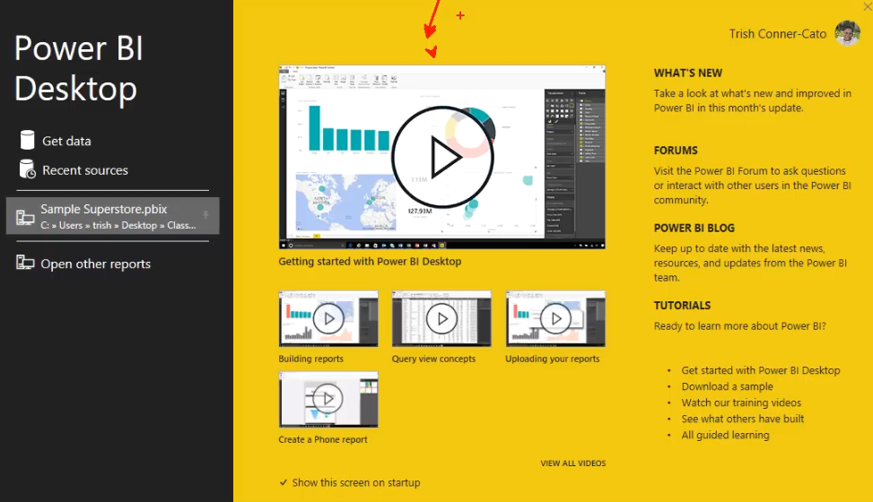 |
|:--:|
| **Splash Screen** |


<!-----------------------------------------------------------------------------------------><hr /> 
# $$\color{orange}{\text{Power BI Desktop Visualizations pane}}$$
**A**

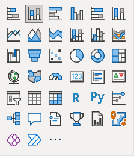

| Row | 1st icon | 2nd icon | 3rd icon | 4th icon | 5th icon | 6th icon |
|---|---|---|---|---|---|---|
| **1** | Stacked bar chart | Stacked column chart | Clustered bar chart | Clustered column chart | 100% stacked bar chart | 100% stacked column chart |
| **2** | Line chart | Area chart | Stacked area chart | Line and stacked column chart | Line and clustered column chart | Ribbon chart |
| **3** | Waterfall chart | Funnel chart | Scatter chart | Pie chart | Donut chart | Treemap |
| **4** | Map | Filled map | Gauge | Card | Multi-row card | KPI |
| **5** | Slicer | Table | Matrix | R script visual | Python visual | Key influencers |
| **6** | Decomposition tree | Q&A | Smart narrative | Scorecard | Paginated report | ArcGIS Maps for Power BI |
| **7** | Power Apps | Power Automate | More visuals (`...`) | | | |


[Visualization Pane](https://learn.microsoft.com/en-us/power-bi/visuals/power-bi-visualizations-overview)

---

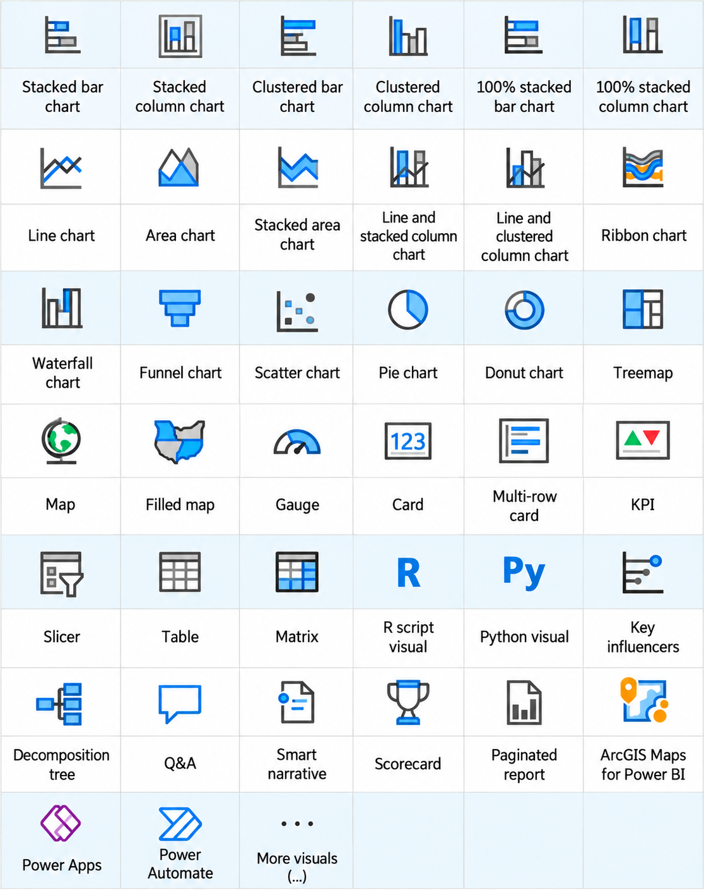

---

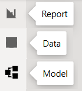

<!-----------------------------------------------------------------------------------------><hr /> 
# $$\color{orange}{\text{Data Types}}$$
**A**   

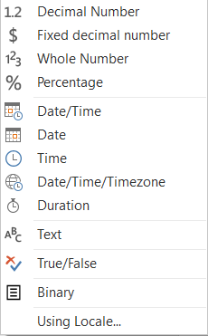

A **data type** tells Power Query what kind of value a column contains and how to process it.

## Power Query Data Types

| Data Type | Keyword / M Type | Typical Size | Description | Example | Range |
|---|---|---|---|---|---|
| **Decimal Number** | `type number` | 8 bytes | Stores whole and fractional numbers using floating-point representation. Approximately 15 significant digits of precision. | `19.95` | Approximately `−1.79 × 10^308` to `+1.79 × 10^308`. |
| **Fixed decimal number** | `Currency.Type` | 8 bytes | Stores numbers with four decimal places of precision. Commonly used for financial values. | `19.9500` | `−922,337,203,685,477.5808` to `922,337,203,685,477.5807`. |
| **Whole Number** | `Int64.Type` | 8 bytes | Stores integers without decimal places. | `25` | `−9,223,372,036,854,775,808` to `9,223,372,036,854,775,807`. |
| **Percentage** | `Percentage.Type` | 8 bytes | Stores a decimal number and displays it as a percentage. | `0.25` → `25%` | Same underlying numeric range as Decimal Number; not limited to `0%–100%`. |
| **Date/Time** | `type datetime` | Implementation-dependent | Stores a date and a time together. | `#datetime(2026, 9, 26, 14, 30, 0)` | Years `1–9999` in M; Power BI model limits differ. |
| **Date** | `type date` | Implementation-dependent | Stores a date without a time. | `#date(2026, 9, 26)` | `0001-01-01` to `9999-12-31` in M. |
| **Time** | `type time` | Implementation-dependent | Stores a time of day without a date. | `#time(14, 30, 0)` | Normally `00:00:00` to `23:59:59.9999999`. |
| **Date/Time/Timezone** | `type datetimezone` | Implementation-dependent | Stores a date and time with a UTC offset. | `#datetimezone(2026, 9, 26, 14, 30, 0, 10, 0)` | Years `1–9999` in M, subject to valid timezone-offset limits. |
| **Duration** | `type duration` | Implementation-dependent | Stores elapsed time in days, hours, minutes, and seconds. | `#duration(2, 3, 30, 0)` = 2 days, 3 hours, 30 minutes | Approximately `−10,675,199` to `+10,675,199` days. |
| **Text** | `type text` | Variable | Stores Unicode characters, including numbers treated as text. | `"Rice"`, `"00123"` | Up to `268,435,456` Unicode characters according to Power Query documentation. |
| **True/False** | `type logical` | Implementation-dependent | Stores a Boolean value. | `true` or `false` | Two logical values: `true` and `false`. |
| **Binary** | `type binary` | Variable | Stores raw bytes, such as file contents. | `#binary({65, 66, 67})` | Each byte is `0–255`; total length depends on resource limits. |

### Notes

- **Typical Size** describes the underlying numeric representation where specified. Actual memory usage includes overhead, and Power BI model compression affects storage size.
- **Implementation-dependent** means a fixed per-value memory size is not guaranteed here.
- **Range** describes supported values, not how many decimal digits remain accurate.
- Power Query **M** supports dates from year `1`; loading dates into the Power BI model has more restrictive limits.
- **Using Locale...** is a conversion option, not a data type. It controls how regional number and date formats are interpreted.

### Example for `price`

`price`: `"19.95"` (Text) → `19.95` (Decimal Number)

The value changes from **text containing digits** to **a number that can be used in calculations**.

`price`: `19.95` (Decimal Number) → Fixed decimal number

The value uses **fixed precision of four decimal places**, equivalent to `19.9500`. The display may omit trailing zeros.

### Using Locale

**Using Locale...** is a conversion option, not a separate data type.

It tells Power Query which regional rules to use when interpreting values.

- `"1,234.56"` + English (United States) → `1234.56`
- `"1.234,56"` + German (Germany) → `1234.56`
- `"26/09/2026"` + English (Australia) → 26 September 2026


<!-----------------------------------------------------------------------------------------><hr /> 

# $$\color{orange}{\text{Power Query}}$$

<!-----------------------------------------------------------------------------------------><hr /> 
# $$\color{orange}{\text{What Is Power Query M?}}$$
**A**

**M** is the programming language used by **Power Query** to connect to data, clean it, and transform it before loading it into Power BI.

When you use buttons in Power Query, it automatically writes **M code** for your actions.

**Your action → Generated M code → Transformed data**

### Example: Changing the `price` Data Type

**Your action:**

Select `price` → Change Data Type → Decimal Number

**Power Query generates M code like this:**

```powerquery
= Table.TransformColumnTypes(
    Source,
    {{"price", type number}}
)
```

**What each part means:**

| Code | Meaning |
|---|---|
| `Table.TransformColumnTypes` | A function that changes column data types. |
| `Source` | The input table from an earlier step. |
| `"price"` | The name of the column being changed. |
| `type number` | The M type used for Decimal Number. |

**Result:**

`price`: `"19.95"` (Text) → `19.95` (Decimal Number)

### Where Can You See M Code?

- **Formula Bar:** Shows the M expression for the selected step.
- **Advanced Editor:** Shows the complete M code for the query.

### M vs DAX

| Language | Main purpose | Example |
|---|---|---|
| **M** | Prepares and transforms data in Power Query. | Change `price` from Text to Decimal Number. |
| **DAX** | Defines calculations in the Power BI data model. | Calculate total sales with a measure. |

**You can use Power Query without writing M yourself. Learning M gives you more control over your transformations.**

---

## Resources for Learning Power Query M

Start with **Goodly’s videos**, practise in Power Query, and keep **Microsoft’s function reference** open while you work.

### Websites and Official References

| Resource | Type | Why Use It? |
|---|---|---|
| [Microsoft — M Quick Tour](https://learn.microsoft.com/en-us/powerquery-m/quick-tour-of-the-power-query-m-formula-language) | Free official tutorial | Learn M syntax, expressions, and `let … in`. |
| [Microsoft — M Function Reference](https://learn.microsoft.com/en-us/powerquery-m/power-query-m-function-reference) | Free official reference | Look up functions, their parameters, and examples while coding. |
| [Ben Gribaudo — Power Query M Primer](https://bengribaudo.com/power-query-m-primer) | Free article series | Understand how M works beyond the Power Query interface. |
| [BI Gorilla — Mastering M Functions Guide](https://gorilla.bi/power-query/mastering-m-functions-guide/) | Free website | Learn which functions to study and in what order. |

### YouTube Videos

| Video | Creator | Purpose |
|---|---|---|
| [Getting Started With M Language in Power Query — Basic to Advanced](https://www.youtube.com/watch?v=5s8Ky5r43uI) | Goodly | An introduction to learning M and progressing beyond Power Query buttons. |
| [Learn Power Query’s M Language in 2024](https://www.youtube.com/watch?v=JmA_L4gOBUA) | Goodly | Guidance for organising your M learning. |

### Books

| Book | Authors | Best Suited To |
|---|---|---|
| [Master Your Data with Excel and Power BI](https://excelguru.ca/master-your-data/) | Ken Puls and Miguel Escobar | Practical data-cleaning exercises with downloadable example files. This is the successor to *M Is for Data Monkey*. |
| [The Definitive Guide to Power Query (M)](https://www.packtpub.com/en-au/product/the-definitive-guide-to-power-query-m-9781835089729) | Greg Deckler, Rick de Groot, and Melissa de Korte | A deeper study of M and more complex transformations. |

**Companion code:** [The Definitive Guide to Power Query (M) — GitHub Examples](https://github.com/PacktPublishing/The-Definitive-Guide-to-Power-Query-M-)

<!-----------------------------------------------------------------------------------------><hr /> 
# $$\color{orange}{\text{Power Query: Replace current vs Add new step}}$$
**A**   

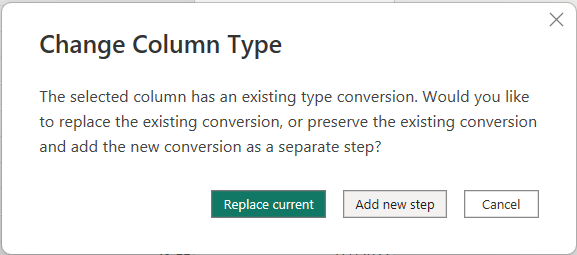

This message appears because the column already has a data type conversion in **Applied Steps**.

| Option | What happens | When to use it |
|---|---|---|
| **Replace current** | Changes the existing type conversion step to your new choice. | The previous data type was a mistake. |
| **Add new step** | Keeps the previous conversion and adds another conversion after it. | You intentionally need both conversions in sequence. |

### Example 1 : Replace current vs Add new step

Suppose `Price` contains `8.75`, but an existing step converts it to **Whole Number**. You now select **Decimal Number**:

1. **Replace current:** Power Query changes the existing step to convert `Price` directly to Decimal Number.
2. **Add new step:** Power Query first converts `Price` to Whole Number, then converts that result to Decimal Number. Any precision lost in the first step cannot be recovered by the second step.

**Rule of thumb:** If you are correcting the column's data type, choose **Replace current**.

## Example 2 : Replace current vs Add new step

**Your actions:**

`price`: `Text` → changed to `Decimal number` → now changing to `Fixed decimal number`   

### Replace current

`price`: `Text` → `Fixed decimal number`

The existing conversion to **Decimal number** is replaced with a conversion to **Fixed decimal number**.

**Result: One conversion step.**

### Add new step

`price`: `Text` → `Decimal number` → `Fixed decimal number`

The existing conversion to **Decimal number** is kept, and another step converts its result to **Fixed decimal number**.

**Result: Two conversion steps.**

<!-----------------------------------------------------------------------------------------><hr /> 
# $$\color{orange}{\text{Pivote and Upivote}}$$
**A**   

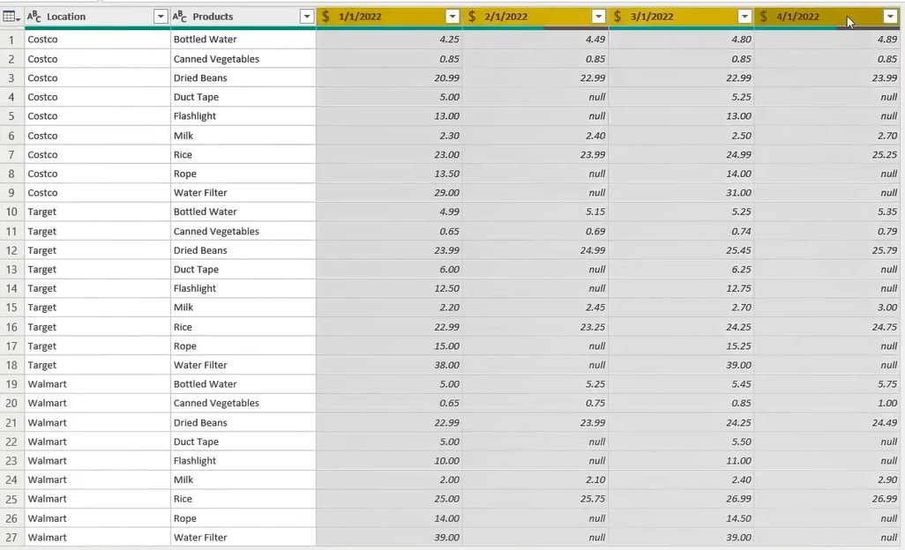   

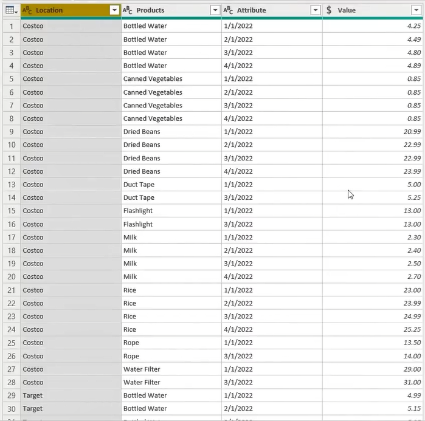   

<!-----------------------------------------------------------------------------------------><hr /> 
# $$\color{orange}{\text{Pivat Table definition}}$$
**B**  

get online data: List of U.S. states and territories by income 


A pivot table summarizes and reorganizes selected columns and rows of data.   
Process and highlight large amounts of data, that would be time consuming to calculate by hand.   
A few data processing functions a pivot table can perform include identifying sums, averages, ranges, and outliers.

> [!NOTE]  
>Excel Pivot Table EXPLAINED in 10 Minutes (Productivity tips included!)
[](https://www.youtube.com/watch?v=UsdedFoTA68&t=115s)   
> How to Create Pivot Table in Excel [](https://www.youtube.com/watch?v=PdJzy956wo4) 

<!-----------------------------------------------------------------------------------------><hr /> 

# $$\color{orange}{\text{Introduction to DAX}}$$
**A**

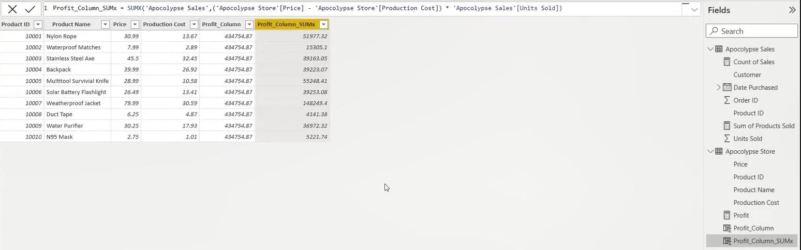   

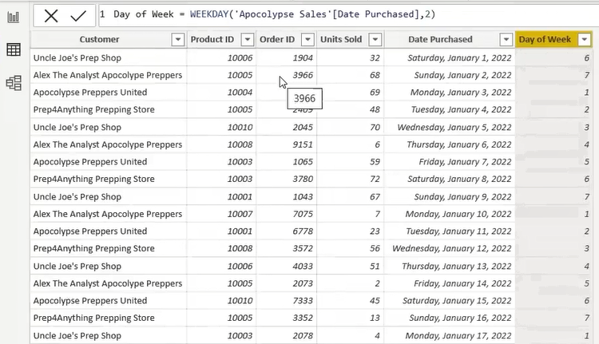   

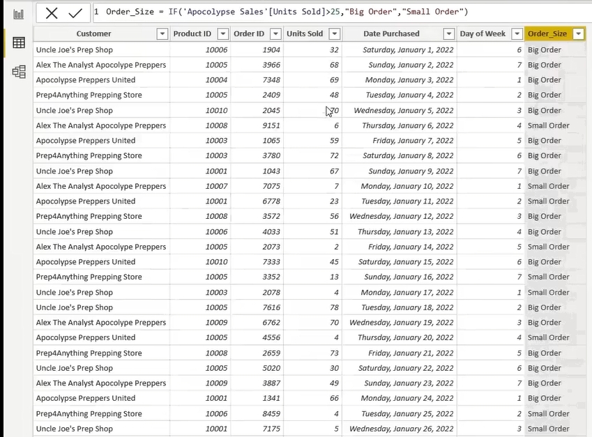   

<!-----------------------------------------------------------------------------------------><hr /> 

# $$\color{orange}{\text{Hierachy in Visualization}}$$
**A** 50:00   

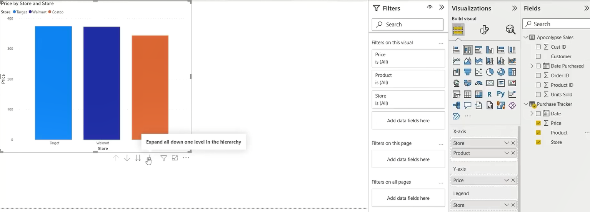

X-axis has 2 field, `Store` and `Product`

And the below Icons activated and shows up.


take it out
<!-----------------------------------------------------------------------------------------><hr /> 

# $$\color{orange}{\text{Bins and List Grouping in Power BI}}$$
**A**
**Grouping** is the process of combining individual values into broader categories to simplify data analysis and visualisation. Power BI supports two grouping methods: **Bin** and **List**.

### Bin Grouping

**Bin grouping**, also called **binning**, automatically divides numeric or date/time values into intervals of equal width. Each value is assigned to an interval according to its value. The intervals are defined by specifying either the **bin size** or the **number of bins**.

**Example:** Grouping customer ages into 10-year intervals, such as `20–29`, `30–39`, and `40–49`.

### List Grouping

**List grouping** combines selected, distinct values into manually defined categories. The user chooses which values belong together and assigns a name to each group. The groups do not require equal intervals or equal numbers of members.

**Example:** Combining selected customer names into groups called `Retail Customers` and `Wholesale Customers`.

Both methods create a new grouped field while preserving the original field.

<!-----------------------------------------------------------------------------------------><hr /> 

## Grouping and Binning in Power BI
**A**
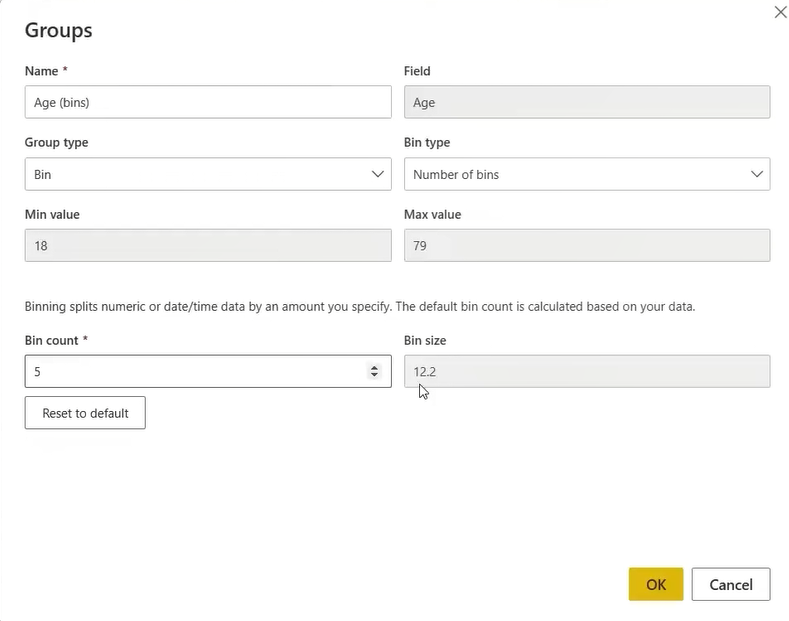   

**Binning** divides numeric or date/time values into equal-width intervals called **bins**.

For example:

Individual ages → Group into 10-year intervals → Analyse the number of people in each interval

### Items in the Groups Window

| Item | Example | Meaning |
|---|---|---|
| **Name** | `Age (bins)` | The name of the new grouped field. You can rename it. |
| **Field** | `Age` | The original column whose values will be grouped. |
| **Group type** | `Bin` | Automatically groups values into equal-width intervals. The alternative, **List**, lets you manually group selected values. |
| **Bin type** | `Number of bins` or `Size of bins` | Determines whether you specify the number of intervals or their width. |
| **Min value** | `18` | The smallest value in the original column. |
| **Max value** | `79` | The largest value in the original column. |
| **Bin count** | `5` | The number used to divide the overall range into intervals. It does not mean five people per group. |
| **Bin size** | `12.2` | The width of each interval, measured in the original column's units. For `Age`, this means years. |
| **Reset to default** | Button | Restores Power BI's automatically suggested setting. |
| **OK** | Button | Saves the settings and creates the bin field. |
| **Cancel** | Button | Closes the dialog without saving the changes. |

### Number of Bins vs Size of Bins

| Bin type | You specify | Power BI determines |
|---|---|---|
| **Number of bins** | The bin count, such as `5`. | The width of each interval. |
| **Size of bins** | The interval width, such as `10` years. | The intervals needed to cover the data. |

### How Your Bin Size Is Calculated — Number of Bins

**Your settings:**

- Minimum age: `18`
- Maximum age: `79`
- Bin count: `5`

**Calculation:**

`Range = Maximum age − Minimum age`

`79 − 18` → `61` years

`Bin size = Range ÷ Bin count`

`61 ÷ 5` → **12.2 years per bin**

**You choose the count → Power BI calculates the size.**

### How Your Bin Size Is Set — Size of Bins

**Your settings:**

- Minimum age: `18`
- Maximum age: `79`
- Bin size: `10` years

There is no bin-size calculation because **you enter the width directly**.

`Bin size = Your chosen interval width` → **10 years**

With numeric bins aligned to multiples of `10`, the age intervals covering your data are:

| Bin label | Interval | Whole-number ages |
|---|---|---|
| `10` | `10 ≤ Age < 20` | `10–19` |
| `20` | `20 ≤ Age < 30` | `20–29` |
| `30` | `30 ≤ Age < 40` | `30–39` |
| `40` | `40 ≤ Age < 50` | `40–49` |
| `50` | `50 ≤ Age < 60` | `50–59` |
| `60` | `60 ≤ Age < 70` | `60–69` |
| `70` | `70 ≤ Age < 80` | `70–79` |

Your data begins at `18`, so the first interval contains only the available ages `18` and `19`.

**You choose the size → Power BI assigns values to the corresponding intervals.**

> Bin boundaries matter: dividing `61 ÷ 10` alone does not establish where the intervals begin. A bin does not necessarily start at your minimum value of `18`.

### Important Distinction

**Equal-width bins do not mean equal numbers of people.**

Each interval spans the same number of years, but one interval might contain `20` people while another contains `100`.

<!-----------------------------------------------------------------------------------------><hr /> 
## List Grouping in Power BI
**A**
    
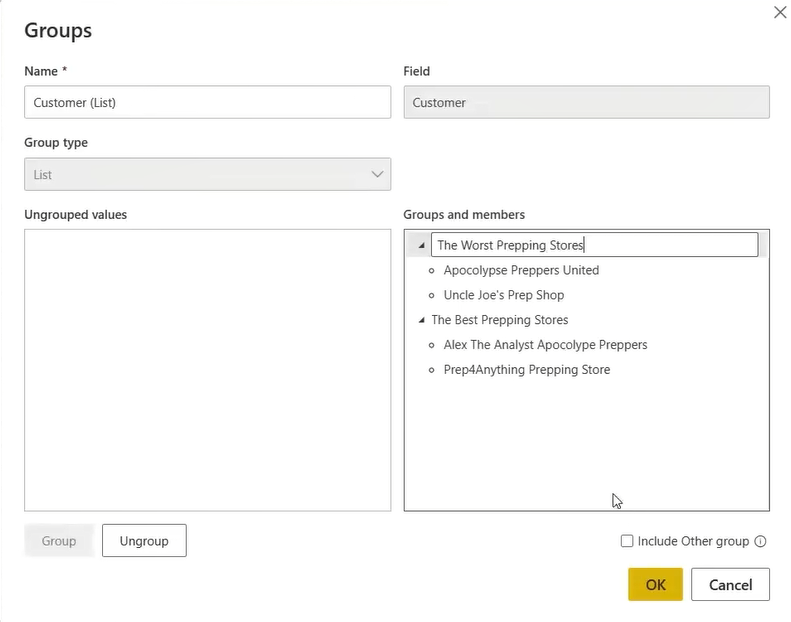   

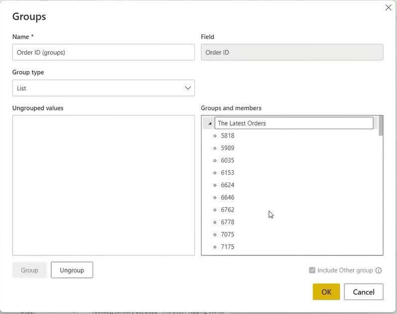   

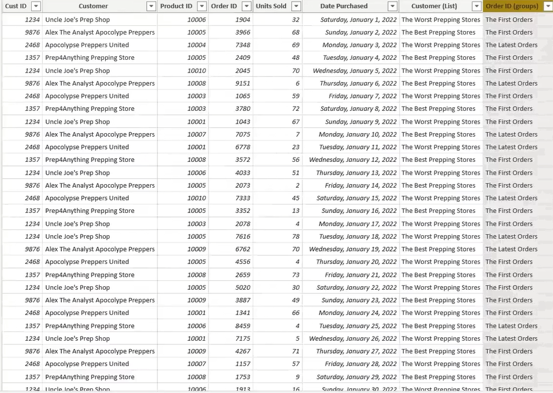   

**List** lets you manually combine selected values into named groups.

**Original values → Select values → Assign a group name**

Unlike **Bin**, which creates equal-width intervals, **List** lets you decide which values belong together.

### Example from Your Picture

The original column is `Customer`. You have organised its values into two groups:

| Original Customer | Assigned Group |
|---|---|
| Apocalypse Preppers United | The Worst Prepping Stores |
| Uncle Joe’s Prep Shop | The Worst Prepping Stores |
| Alex The Analyst Apocalypse Preppers | The Best Prepping Stores |
| Prep4Anything Prepping Store | The Best Prepping Stores |

**Four customer names → Two manually defined groups**

These names are labels you assign. Power BI does not automatically decide which stores are “best” or “worst”.

### Items in the Groups Window

| Item | Your Setting | Meaning |
|---|---|---|
| **Name** | `Customer (List)` | The name of the new grouped field. |
| **Field** | `Customer` | The original column containing the values you want to group. |
| **Group type** | `List` | Lets you manually select values and combine them into named groups. |
| **Ungrouped values** | Empty in your picture | Values that have not been assigned to a group. It is empty because all displayed customer values have been grouped. |
| **Groups and members** | Two groups with their customers | Shows each group name and the original values belonging to it. |
| **Group** | Button | Combines selected values into a group. It is disabled in your picture because no ungrouped values are selected. |
| **Ungroup** | Button | Removes selected members from a group, or breaks apart a selected group. |
| **Include Other group** | Unchecked | When checked, values not assigned to your named groups are collected into an `Other` group. When unchecked, they remain separate values. |
| **OK** | Button | Saves your grouping. |
| **Cancel** | Button | Closes the dialog without saving your changes. |

### How to Create a List Group

1. In **Ungrouped values**, hold **Ctrl** and select the values you want to combine.
2. Click **Group**.
3. Double-click the group name to rename it.
4. Repeat for your other groups.
5. Click **OK**.

**Select customers → Click Group → Rename the group → Click OK**

### How to Use the New Field

Use `Customer (List)` in a visual to compare the groups.

For example:

`Customer (List)` on the X-axis + `Total Sales` on the Y-axis  
→ Compare total sales for the two store groups.

The original `Customer` column remains available, so you can still analyse individual stores.

### List vs Bin

| Group Type | How Groups Are Created | Example |
|---|---|---|
| **List** | You manually choose the members of each group. | Selected customers → `The Best Prepping Stores` |
| **Bin** | Power BI assigns numeric or date/time values to equal-width intervals. | Ages → 10-year intervals |


<!-----------------------------------------------------------------------------------------><hr /> 
01:29:00
# $$\color{orange}{\text{Conditional Formating}}$$
**A**


<!-----------------------------------------------------------------------------------------><hr /> 

# $$\color{purple}{\text{First Title}}$$
**B**


<br /> <br /> <br /> <br /> <br /> <br /> <br /> <br /> <br /> 
<br /> <br /> <br /> <br /> <br /> <br /> <br /> <br /> <br /> 

<hr />
💡
✅ 
🎓 Academic Honesty
📚 References
🔗 [Node.js Official site](https://nodejs.org/)
💻 Source Code

Insert an emoji On Windows, press: `Windows key + .`

### [Nginx More](./Material/Nginx.md "Nginx is a web server, reverse proxy and load balancer.")

# 22222. The Promise-Based ,`async/await` (Pattern) in Node.js

- chatGPT : I’ll transcribe the image into GitHub Markdown, with emojis only in the headings.
- 
# $$\color{orange}{\text{Terminology}}$$

| Syntax      | Description | Test Text     |
| :---        |    :----:   |          ---: |
| Header      | Title       | Here's this   |
| Paragraph   | Text        | And more      |


